

<b>
<h2>SMS de Herramientas de Automatización de Pruebas</h2>
</b>

<h2 style="color: gray">Seminario de Trabajo de Grado</h2>

<h5>Brahiam David Tabares Vallejo Sandra Milena Quintero Leal Juan Alvaro Díaz Trujillo Daniela Villegas Christian Andrés Candela</h5>

---

# - Contexto
# - Objetivo
# - Metodología
# - Conclusiones

---

<b>
<h1>Contexto</h1>
</b>

---

# Calidad de software
 La realización de pruebas de software de manera eficiente y efectiva desempeña un papel fundamental en la garantía de la seguridad y calidad de los productos de software. 

---

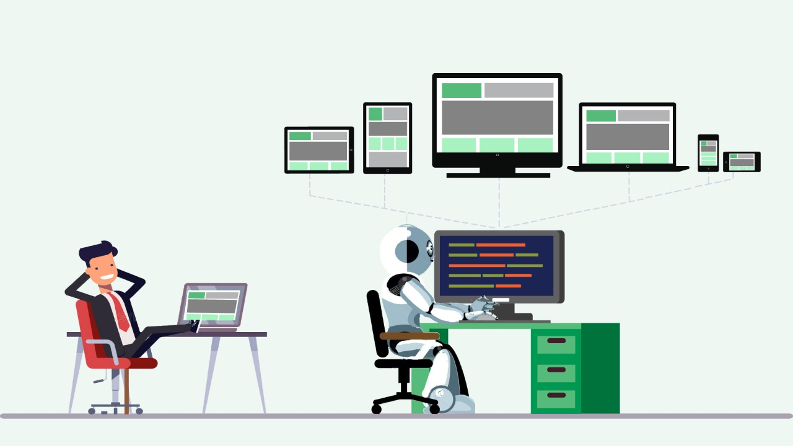

# Automatización de pruebas
El uso de una herramienta de automatización agiliza significativamente el proceso de pruebas, lo que a su vez contribuye a una etapa de prueba más rápida y eficiente. 

---

<b>
<h1>Objetivo</h1>
</b>

---

# Realizar un estudio de mapeo sistemático (SMS) para identificar las herramientas y tecnologías que son utilizadas para elaboración de las pruebas de software automatizadas.

---

<b>
<h1>Metodología</h1>
</b>

---

<h1 style="color: gray">Proceso de Mapeo Sistemático</h1>

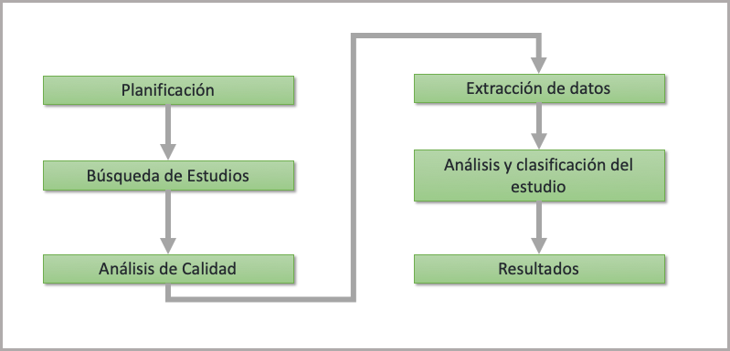

---

# Planificación.

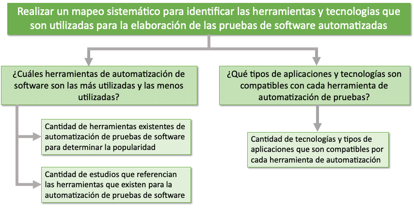

---

# Búsqueda de estudios.

---

# Búsqueda de estudios.

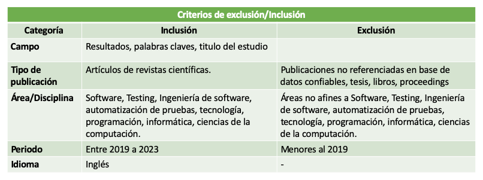

---

# Búsqueda de estudios.

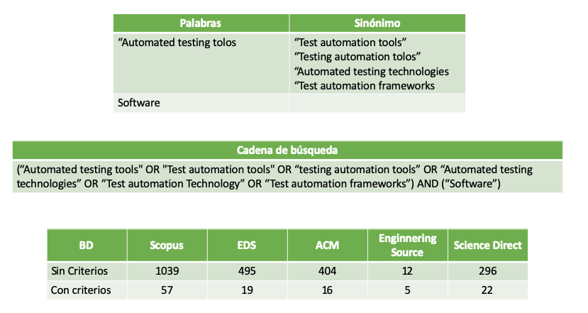

---

# Búsqueda de estudios.

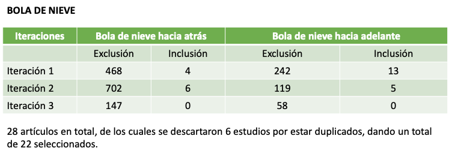

---

# Análisis de calidad.

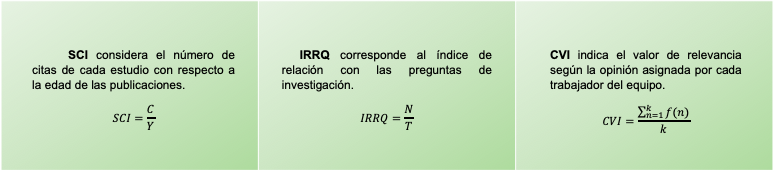

---

# Extracción de datos.

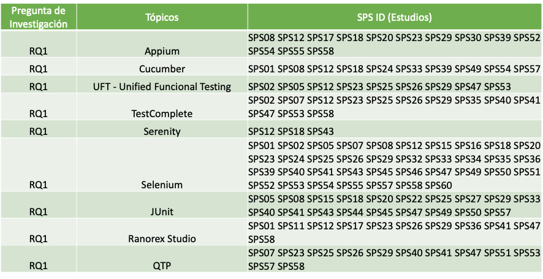

---

# Análisis y clasificación de estudios

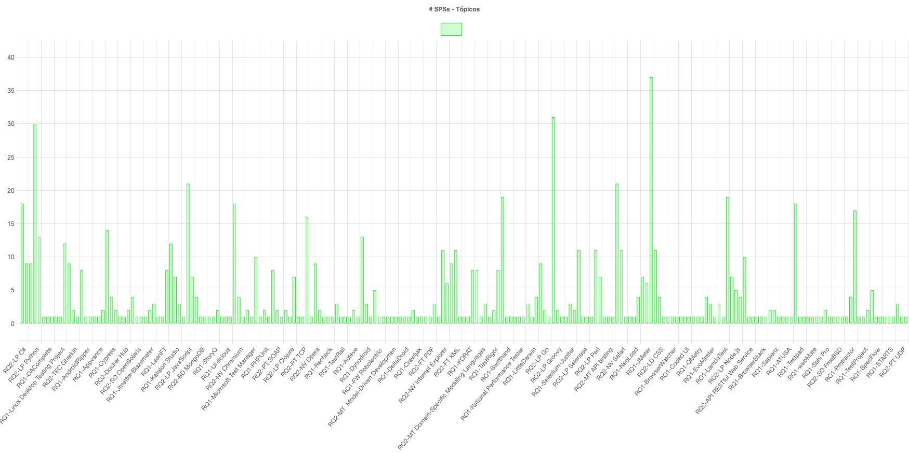

---

# Análisis y clasificación de estudios

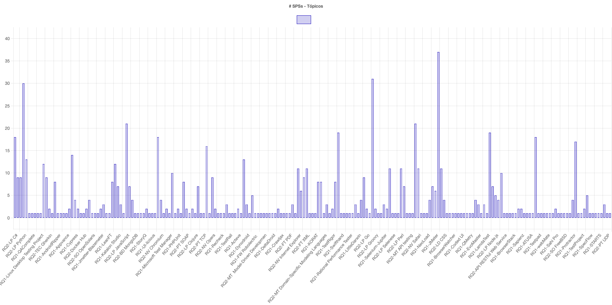

---

# Resultados.

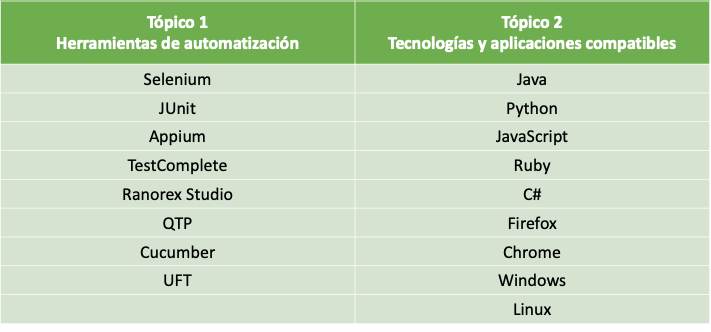

---

<b>
<h1>Conclusiones</h1>
</b>

---

- # Conclusión 1 

---

<b>
<h1>Preguntas</h1>
</b>

---

[1] Maheshwari H, Mohammad S, Rana I, Goswami P. A REVIEW OF TOOLS AND TECHNIQUES USED IN SOFTWARE TESTING. SSRN Electronic Journal. 2019 
[2] Albarka U, Zhanfang C. A Study of Automated Software Testing: Automation Tools and Frameworks. International Journal of Computer Science Engineering (IJCSE). 2019 
[3] Jacob P, Mani P. A framework for evaluating performance of software testing tools. International Journal of Scientific and Technology Research. 2020 
[4] Jacob P, Mani P. A performance estimation model for software testing tools. International Journal of Engineering and Advanced Technology. 2019 
[5] García B, Gallego M, Gortázar F, Munoz-Organero M. A survey of the selenium ecosystem. Electronics (Switzerland). 2020
[6] Kos T, Mernik M, Kosar T. A tool support for model-driven development: An industrial case study from a measurement Domain. Applied Sciences (Switzerland). 2019
[7] Demircioğlu E, Kalipsiz O. API Message-Driven Regression Testing Framework. Electronics (Switzerland). 2022
[8] Ateşoğulları D, Mishra A. AUTOMATION TESTING TOOLS: A COMPARATIVE VIEW. International Journal of Information and Computer Security. 2020
[9] Qin J, Zhang H, Wang S, Geng Z, Chen T. Acteve++: An Improved Android Application Automatic Tester Based on Acteve. IEEE Access. 2019
[10] Mohammed E, Mustapa M, Rahim H, Norizan M. Advanced UI test automation (AUTA) for BIOS validation using OpenCV and OCR. Indonesian Journal of Electrical Engineering and Computer Science. 2021
[11] Leotta M, Ricca F, Marchetto A, Olianas D. An empirical study to compare three web test automation approaches: NLP-based, programmable, and capture&replay. Journal of Software: Evolution and Process. 2023
[12]. Krishna V, Gopinath G. Cloud based Agile Methodology Test Automation for Web Application by Using Tanh Activated Clustering and Classification Model (TACC) in Machine Learning. Webology. 2021
[13] Ardito L, Coppola R, Leonardi S, Morisio M, Buy U. Automated Test Selection for Android Apps Based on APK and Activity Classification. IEEE Access. 2020
[14] García B, Munoz-Organero M, Alario-Hoyos C, Delgado Kloos C. Automated driver management for selenium WebDriver. Empirical Software Engineering. 2021
[15] Vos T, Prasetya I, Eldh S, Getir S, Parsai A, Aho P. Automating TEST Case Design, Selection and Evaluation Report on 10 Editions of A-TESTWorkshop. SIGSOFT Softw. Eng. Notes. 2020
[16] Ashish, Nishu. Automation Testing Using Selenium+Sikuli Scripting. International Journal of Computer Sciences and Engineering. 2019
[17] Lei Z, Chen Y, Yang Y, Xia M, Qi Z. Bootstrapping Automated Testing for RESTful Web Services. Fundamental Approaches to Software Engineering. 2021
[18] Arcuri A, Zhang M, Belhadi A, Marculescu B, Golmohammadi A, Galeotti J, Seran S. Building an open-source system test generation tool: lessons learned and empirical analyses with EvoMaster. Software Quality Journal. 2023
[19] Fatima S, Nasim S, Haider N, Rasheed M, Akram Z. Comparative Study of Software Automation Tools: Selenium and Quick Test Professional. Journal of Independent Studies and Research Computing. 2023
[20] Eldrandaly K, ElLatif M, Zaki N. Comparative Study of Software Test Automation Frameworks. International Journal of Engineering Trends and Technology. 2019
[21] Jacob P, Priyadarsini S, Varghese R, Samuel S, Mani P. Comparative analysis on software testing tools and strategies. International Journal of Scientific and Technology Research. 2020
[22] Gamido H, Gamido M. Comparative review of the features of automated software testing tools. International Journal of Electrical and Computer Engineering. 2019
[23] Maspupah A, Rahmani A, Min J. Comparative study of regression testing tools feature on unit testing. Journal of Physics: Conference Series. 2021
[24] Di Martino S, Fasolino A, Starace L, Tramontana P. Comparing the effectiveness of capture and replay against automatic input generation for Android graphical user interface testing. Software Testing: Verification &amp; Reliability. 2021
[25] Karthik M, Vk J. Comparison of Software Test Automation Tools-Selenium and UFT. American International Journal of Research in Formal, Applied & Natural Sciences AIJRFANS. 2019
[26] Ghorbani N, Jabbarvand R, Salehnamadi N, Garcia J, Malek S. DeltaDroid: Dynamic Delivery Testing in Android. ACM Trans. Softw. Eng. Methodol. 2023
[27] Venkatraj S, Vincent R, Vijayakumar V, Vengatesan K, Rajesh M. Development of test automation framework for REST API testing. Journal of Computational and Theoretical Nanoscience. 2019

---

[28] Singh G, Choudhary J, Laddhani L. Enhancing Testing Efficiency through the Implementation of an Optimal Test Automation Framework Selection Model. International Journal of INTELLIGENT SYSTEMS AND APPLICATIONS IN ENGINEERING. 2023
[29] García B, Ricca F, del Alamo J, Leotta M. Enhancing Web Applications Observability through Instrumented Automated Browsers. Journal of Systems and Software. 2023
[30] Kualandaru D, Yuniar Banowosari L. Evaluation of Automation Testing Tools Using Quality Model ISO 9126.  International Research Journal of Advanced Engineering and Science. 2021
[31] Islam M, Quadri S. Framework for automation of cloud-application testing using selenium (FACTS). Advances in Science, Technology and Engineering Systems. 2020
[32] Anand A, Uddin A. Importance of Software Testing in the Process of Software Development. IJSRD - International Journal for Scientific Research & Development Vol. 6, Issue 12, 2019
[33]  Tiwari P, Pandey S, Thamba Meshach W, Parashar J, Kumar A, Altuwairiqi M, Krah D. Improved Data Security in Cloud Environment for Test Automation Framework and Access Control for Industry 4.0. Wireless Communications and Mobile Computing. 2022
[34] Saravanan K, Balakrishnan S. Key factors & features influencing selection of open source functional test automation tools. International Journal of Recent Technology and Engineering. 2019
[35] Suguna Mallika S, Rajya Lakshmi D. MUTWEB-A testing tool for performing mutation testing of java and servlet based web applications. International Journal of Innovative Technology and Exploring Engineering. 2019
[36] Baytar C. Model Proposal for Testing Websites in Multiple Browsers: Case of Selenium Test Tool Çoklu Tarayıcılarda Web Sitesi Testine Yönelik Model Önerisi: Selenium Test Aracı Örneği. Topkapı Journal of Social Science, Vol. 1, No. 2, 2022
[37] Thekkan Othayoth J, Anuar S. Modern Web Automation with Cypress.Io Article history. Open International Journal of Informatics (OIJI) Vol. 10 No. 2. 2022
[38] Leotta M, Paparella D, Ricca F. Mutta: a novel tool for E2E web mutation testing. Software Quality Journal. 2023
[39]  Marculescu B, Zhang M, Arcuri A. On the Faults Found in REST APIs by Automated Test Generation. ACM Trans. Softw. Eng. Methodol. 2022
[40] García B, López-Fernández L, Gortázar F, Gallego M. Practical evaluation of VMAF perceptual video quality for webRTC applications. Electronics (Switzerland). 2019
[41] Kazimov T, Bayramova T, Malikova N. RESEARCH OF INTELLIGENT METHODS OF SOFTWARE TESTING. System Research and Information Technologies. 2021
[42] Wardhan H, Madan D. STUDY ON FUNCTIONING OF SELENIUM TESTING TOOL. International Research Journal of Modernization in Engineering Technology and Science. 2021
[43] Chimuco F, Sequeiros J, Lopes C, Simões T, Freire M, Inácio P. Secure cloud-based mobile apps: attack taxonomy, requirements, mechanisms, tests and automation. International Journal of Information Security. 2023
[44] García B, Delgado Kloos C, Alario-Hoyos C, Munoz-Organero M. Selenium-Jupiter: A JUnit 5 extension for Selenium WebDriver. Journal of Systems and Software. 2022
[45] Olianas D, Leotta M, Ricca F. SleepReplacer: a novel tool-based approach for replacing thread sleeps in selenium WebDriver test code. Software Quality Journal. 2022
[46] Margaret Teacher Banjarnahor, Istiyowati L. Smoke Automation and Regression Testing on a peer-to-peer lending Website with the Data-DrivenTesting Method. Jurnal RESTI (Rekayasa Sistem dan Teknologi Informasi). 2022
[47] Vadan A, Miclea L. Software Testing Techniques for Improving the Quality of Smart-Home IoT Systems. Electronics (2079-9292). 2023
[48] Jadhav S. Study of Different Software Testing Automation Tools. Journal of Computer Science Engineering and Software Testing. 2019
[49] Singh G. Taxonomic Analysis of DevOps Tools. JOURNAL OF ALGEBRAIC STATISTICS. 2023
[50] Sivanandan S. Test Automation Framework as a Service (TAFaaS) - scale test automation & devops practices with cloud, containers, and microservice. International Journal of Innovative Technology and Exploring Engineering. 2019
[51] Florea R, Stray V. The skills that employers look for in software testers. Software Quality Journal. 2019
[52] Abdulwareth A, Al-Shargabi A. Toward a Multi-Criteria Framework for Selecting Software Testing Tools. IEEE Access. 2021
[53] Neethidevan V, Chandrasekaran G. Web automation using selenium web driver python. International Journal of Recent Technology and Engineering. 2019

---
<!-- 
_header: ''
_footer: '' 
_paginate: false
_backgroundImage: url('gracias.png')
-->
