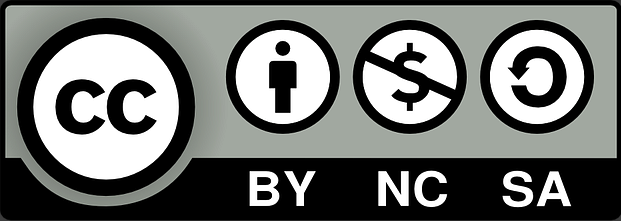

<b>
<h2>SMS</h2>
</b>

<h1 style="color: gray">Seminario de Trabajo de Grado</h1>

<h5>Brahiam David Tabares Vallejo</h5><h5>Sandra Milena Quintero Leal</h5>
<h5>Juan Alvaro Díaz Trujillo</h5><h5>Daniela Villegas</h5>
<h5>Christian Andrés Candela</h5>

---

- Contexto
- Objetivo
- Metodología
- Resultados

---

<b>
<h1>Contexto</h1>
</b>

---

# Calidad de software
## La realización de pruebas de software de manera eficiente y efectiva desempeña un papel fundamental en la garantía de la seguridad y calidad de los productos de software. 

---

# Automatización de pruebas
## El uso de una herramienta de automatización agiliza significativamente el proceso de pruebas, lo que a su vez contribuye a una etapa de prueba más rápida y eficiente. 

---

<b>
<h1>Objetivo</h1>
</b>

---

# Realizar un estudio de mapeo sistemático (SMS) para identificar las herramientas y tecnologías que son utilizadas para elaboración de las pruebas de software automatizadas.

---

<b>
<h1>Metodología</h1>
</b>

---

<h1 style="color: gray">Proceso de Mapeo Sistemático</h1>

---

# Planificación.

---

# Búsqueda de estudios.

---

# Búsqueda de estudios.

---

# Búsqueda de estudios.

)

---

# Análisis de calidad.
- índice de citas de estudio – SCI, 
- índice de relación con preguntas de investigación – IRRQ 
- índice de valor de contenido – CVI

---

# Extracción de datos.

---

# Análisis y clasificación 
# de estudios

---

# Resultados.

---

<b>
<h1>Resultados</h1>
</b>

---

# Resultados.

---

<b>
<h1>Preguntas</h1>
</b>

---

- Maheshwari H, Mohammad S, Rana I, Goswami P. A REVIEW OF TOOLS AND TECHNIQUES USED IN SOFTWARE TESTING. SSRN Electronic Journal. 2019 
- Albarka U, Zhanfang C. A Study of Automated Software Testing: Automation Tools and Frameworks. International Journal of Computer Science Engineering (IJCSE). 2019 
- Jacob P, Mani P. A framework for evaluating performance of software testing tools. International Journal of Scientific and Technology Research. 2020 
- Jacob P, Mani P. A performance estimation model for software testing tools. International Journal of Engineering and Advanced Technology. 2019 
- García B, Gallego M, Gortázar F, Munoz-Organero M. A survey of the selenium ecosystem. Electronics (Switzerland). 2020

---

<!-- 
_header: ''
_footer: '' 
_paginate: false
_backgroundImage: url('gracias.png')
-->
